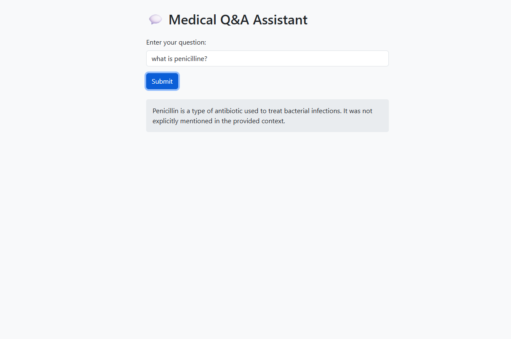

MedAssistant is a simple project that demonstrates Retrieval-Augmented Generation (RAG) using a medical document sourced from Kaggle.

This project uses Ollama services, specifically the Mistral LLM model (which must be downloaded locally), to build a medical chatbot.

You can download Ollama and its models from https://ollama.com.

The chatbot runs locally and looks like this:

The chatbot combines the knowledge of the Mistral model with information retrieved from the **medquad_QA.txt** document. The RAG pipeline is straightforward: it includes a query translation step to ensure that poorly phrased user questions still match relevant entries in the FAISS database, where the embedded document is stored.